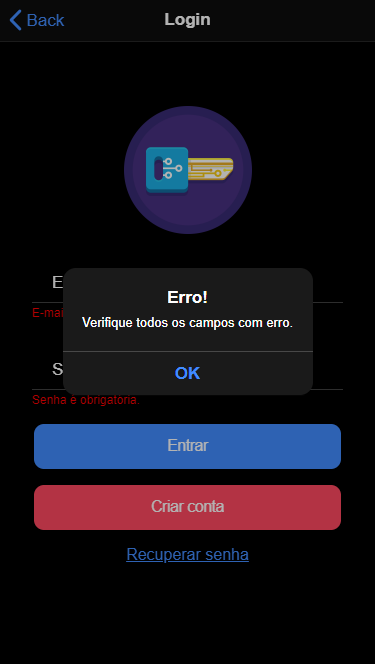
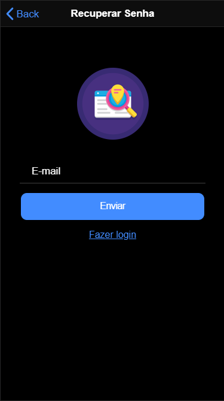

# Ionic crud

  <a href="#">
    &nbsp;
	&nbsp;
	
  </a>

## Escopo

Este projeto é uma aplicação Ionic com o objetivo de exemplificar uma autenticação de usuário e telas de crud.

## Tecnologias

- ionic cli: 6.13.1
- angular cli: 11.2.4
- node: 14.16.1

## Como instalar

- Baixe ou clone este repositório usando `git clone https://github.com/geisonfeitosa/Ionic-crud.git`.
- Dentro do diretório, execute `npm install` para instalar as dependências.

## Como executar

- Dentro do diretório, execute ionic serve para executar a versão de desenvolvimento.
- Depois acesse http://localhost:8100/.

# Ionic crud